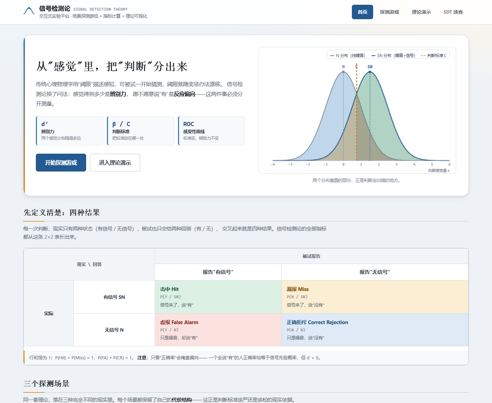
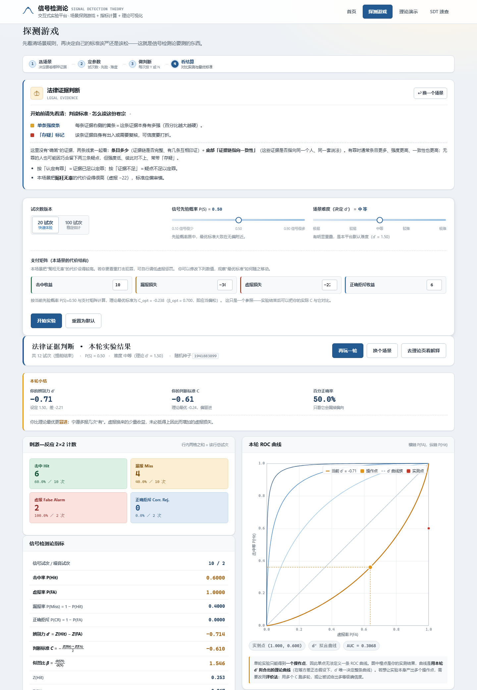
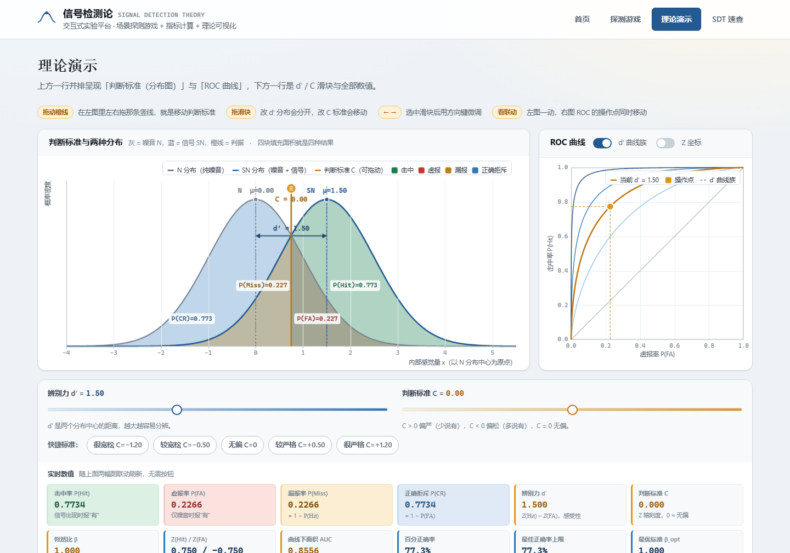
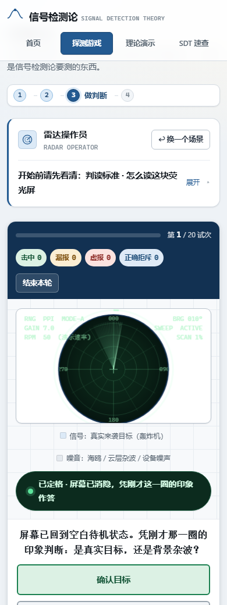

# 信号检测论（Signal Detection Theory）交互式教学网页

一个**零依赖、零构建**的单页教学网站：双击 `index.html` 即可在浏览器打开，不需要安装任何东西、不需要起服务器、不联网。

内容覆盖三个可玩的探测游戏（每个都有 20 / 100 试次两个版本）、一局一结算的 SDT 指标报表与 ROC 曲线，以及一个可以**拖动判据**实时观察 d′、β、C 与 ROC 变化的理论演示台。数学内核用 Python（scipy / mpmath）独立复算验证过。

## 效果预览

| 首页（判据把两个分布切开） | 一局结束后的 SDT 报表 |
|---|---|
|  |  |

| 理论演示台（上排分布图 + ROC，下排滑块 + 12 个指标） | 手机端（竖屏，判定按钮在画布右侧） |
|---|---|
|  |  |

更多截图在 [`fig/`](fig/)：桌面首页 / 手机首页 / 游戏进行中 / 理论演示（桌面与手机）。

---

## 1. 怎么跑

### 方式一：在线地址（直接发给别人即可）

```
https://sdt-lab.app.workbuddy.host/
```

手机、平板、电脑打开同一个链接就能玩，无需安装、无需局域网。结果存在各自浏览器的 localStorage 里，换设备不继承。

### 方式二：单文件版（发给手机 / 只允许交一个文件的场合）

```
dist/SDT-单文件版.html      ← 276 KB，CSS / JS / 图标全部内联
```

**为什么需要它**：本工程的 `index.html` 引用了 4 个 CSS + 7 个 JS + 1 个 SVG（共 12 个独立文件）。
只把 `index.html` 一个文件发到手机或单独交上去，其余 11 个全部加载失败 —— 页面会退化成**没有配色、没有布局、画布空白**的裸 HTML。
单文件版把 12 个依赖全部内联进一个 `.html`，发送 / 上传单个文件即可完整运行（微信、QQ、AirDrop、U 盘都行）。

重新生成（改完源码后执行，会自动校验无残留外链）：

```bash
npm run build:single            # 等价于 node tools/build-single.js
```

> 手机端提示：iOS / Android 收到 `.html` 附件后，选择「用浏览器打开」即可；
> 微信内置浏览器若打不开，点右上角「⋯ → 在浏览器中打开」。

### 方式三：本地双击

```
双击 index.html
```

如果浏览器对本地文件有限制，也可以起一个静态服务：

```bash
python -m http.server 8000     # 然后访问 http://localhost:8000
```

推荐 Chrome / Edge / Firefox 最新版，手机浏览器（iOS Safari / Chrome for Android）同样支持。

### 跨设备访问（手机 / 平板 / 别的电脑）

`file://` 协议没法让别的设备打开同一份页面，所以仓库里带了一个**零依赖**的本地服务器：

```bash
node tools/serve.js            # 默认 8080
node tools/serve.js 3000       # 换端口
```

Windows 上也可以直接双击 `tools/serve.cmd`。启动后它会打印两类地址：

```
本机      http://localhost:8080
局域网    http://192.168.x.x:8080   ← 手机 / 平板连同一 Wi-Fi 后打开
```

只用 Node 内置模块（无需 `npm install`）；为 `.js` 返回正确的 `text/javascript`、禁用缓存（改完刷新即见）、
拒绝目录穿越（只服务项目目录内的文件）、端口被占用时自动顺延。

**同一台设备上换个浏览器 / 换个尺寸也直接可用**：页面不引用任何 CDN 资源、不含本机绝对路径，断网也能打开。

---

## 2. 页面结构

顶部四个视图：

| 视图 | 内容 |
|---|---|
| **首页** | 四种结果（击中 / 漏报 / 虚报 / 正确拒斥）的 2×2 矩阵、三个场景入口、公式速查 |
| **探测游戏** | 选场景 →（选卡区原地换成规则卡）→ 设参数 → 作答 → 结算报表 |
| **理论演示** | N/SN 分布、d′ 与 C 的拖动演示、ROC 曲线联动 |
| **SDT 速查** | 公式表、三种实验方法对比、d′ 数值对照表、计算约定 |

---

## 3. 移动端与跨设备（同一个设计，不砍内容）

站点是**一套设计**跑所有设备，不做"手机版另做一套"。原则是：换排布、不删内容；
实在放不下的宽内容（公式行、宽表格）退化成横向滚动，而不是缩到看不清。

| 断点 | 变化 |
|---|---|
| ≥1180px | 理论页两行式：判断标准 \| ROC 并排，指标 6 列 × 2 行 |
| ≤1180px | 理论页两块画布上下堆叠，指标 4 列 |
| ≤1040px | 游戏的判定栏从画布右侧落回下方，恢复横排按钮 |
| ≤760px | 导航换行、指标 2 列、画布按 1.9:1 显示 |
| ≤560px | 分布画布改 1.35:1（更方，给曲线留高度）、隐藏键盘提示、长说明默认收起 |
| ≤400px | 各 `minmax()` 网格收成单列，避免轨道顶破视口 |
| 横屏矮屏 | 竖向留白整体收一档，操作指引压成一行 |

几处专为触屏做的处理：

- **画布的窄屏绘制分支**：手机宽度下收紧留白、降一档字号、图例拆成两行短标签。
  四个 P(...) 数值标签在窄屏不再挤在图上——它们本来就是下方「实时数值」里的独立瓦片，信息一个不少。
- **拖拽与滑屏共存**：判断标准画布 `touch-action: pan-y`，横向拖判据、纵向照常滚页；
  触屏上命中范围放宽到 40px，且**轻点即定位**（没有鼠标就没有双击）。
- **命中区放大只在触屏生效**：所有 `min-height: 44px+` 的规则都锁在
  `@media (hover: none) and (pointer: coarse)` 里，鼠标环境的视觉零改动。
- **长说明默认收起**：「开始前请先看清」规则卡与局内判读标准都做成 `<details>`，
  触屏默认收起、桌面默认展开。手机竖屏下这让"画布 + 判定按钮"真正落在一屏内。
- **提示随输入方式切换**：触屏隐藏 `<kbd>Y</kbd>` 这类键盘提示，改显「手指拖动」的说法；
  可横向滚动的图表补一条「表格可左右滑动查看」。
- **视口细节**：`viewport-fit=cover` + `env(safe-area-inset-*)` 让开刘海与底部手势条；
  `100dvh` 兜住 iOS 地址栏伸缩；`resize` 防抖且**只比较宽度与 DPR**（地址栏一缩一放不该触发重绘）；
  另外单独监听 `orientationchange` 与 `visualViewport`。

---

## 4. 三个游戏

| 场景 | 信号（SN） | 噪音（N） | 支付矩阵（击中/漏报/虚报/正确拒斥） | 判据倾向 |
|---|---|---|---|---|
| **雷达操作员** | 真实来袭目标 | 海鸥、云层杂波、设备噪声 | +12 / −40 / −6 / +4 | 漏报代价极高 → 标准偏**宽松** |
| **法律证据判断** | 被告确实有罪 | 被告无罪但巧合留下疑点 | +10 / −30 / −22 / +6 | 冤枉无辜代价高 → 标准偏**严格** |
| **工业探伤** | 焊缝存在真实缺陷 | 晶粒噪声、耦合不良 | +14 / −38 / −14 / +5 | 漏检可能断裂 → 标准偏**宽松** |

三个场景各自的证据呈现方式不同：

- **雷达操作员**：真实地把天线**转一整圈**再让你判断。光束顺时针扫过 360°，
  只有被扫到的方位才会点亮回波，之后按荧光余辉指数衰减；**转满一圈后余辉整体熄灭、
  屏幕回到空白的默认待机界面**，这时才开放作答。
- **法律证据判断**：一份证据卷宗卡片（逐条强度条 + 一致性仪表 + 印章）。
- **工业探伤**：A 型显示（A-scan）超声波形。

> **为什么判断必须发生在"屏幕清空之后"？**
> 如果作答时屏上还留着点迹，被试就变成"看着静态截图判断"，
> 判断依据成了"我能不能看见这个亮点"，而不是"刚才那次回波有多强"；
> 更糟的是余辉残留会随目标所处方位剧烈变化（刚扫过的亮、一圈前扫过的暗），
> 等于凭空引入一个与信号强度完全无关的判断线索，d′ 会被污染。
> 清空之后，判断只能依据扫描过程中在脑中留下的印象——
> 这与真实雷达观测的情形一致，也让 d′ 真正衡量"辨别力"。
>
> 觉得记不住时按 `R` 再看一圈：重放的是同一份 evidence，不算作答次数。

### 游戏页布局（一屏里的视线动线）

一轮游戏要走四步。顶部常驻一条**流程步骤条**，当前步高亮、已完成的步打浅蓝底：

```
① 选场景  ─  ② 定参数  ─  ③ 做判断  ─  ④ 看结算
  决定要看      试次数        每次按        对比实测
  哪种证据      先验·难度     Y 或 N        与最优标准
```

- **步骤号由画面推导，不靠手动维护**：`showGamePhase('pick' | 'setup' | 'play' | 'report')`
  一次性决定三个区块的显隐与该显示第几步（见 `js/app.js` 的 `PHASE` 表）。
  原先这三处 `hidden` 赋值散在四个函数里各写一遍，漏改一处步骤条就指错路。
- 阶段与画面：`pick` = 三张选卡；`setup` = 选卡区换成规则卡 + 参数面板；
  `play` = 只留舞台；`report` = 参数面板（方便改参数再来一轮）+ 结算报表。

选场景这一步：

```
未选场景                     选中场景后
┌───────┬───────┬───────┐   ┌───────────────────────────┐
│ 雷达  │ 法律  │ 探伤  │ → │  ← 换一个场景  雷达操作员   │  ← 选卡区整块换成
└───────┴───────┴───────┘   │  开始前请先看清：判读标准… │     该场景的规则卡
                            └───────────────────────────┘
                            ┌───────────────────────────┐
                            │ 试次数 / 先验 / 难度 / 支付 │
                            └───────────────────────────┘
```

两个滑块下方都有**刻度**：难度标出全部五档名称，先验概率标出两端与中点。
只看一个孤立滑块，玩家不知道一共几档、拖到哪了。

一轮进行中的画面：

```
┌───────────────────────────────────────┬──────────────┐
│  画布（雷达屏 / 卷宗 / A-scan）        │ 提示语        │
│                                       │ ┌──────────┐ │ ← 判定栏
│                                       │ │ Y 有信号 │ │   常驻右侧、滚动时
│                                       │ └──────────┘ │   粘住不跑
│                                       │ ┌──────────┐ │
│                                       │ │ N 无信号 │ │
│                                       │ └──────────┘ │
│  状态条（转圈中 / 已熄屏待判断）        │ 再看一圈 / 反馈│
└───────────────────────────────────────┴──────────────┘
```

- **Y / N 在画布右侧**（`.stage__rail`），不用上下滑动就能看见；
  窄于 1040px 才落回画布下方，窄于 760px 才变回横排大按钮。
- 判定栏用 `position: sticky` 粘在顶部导航下面 —— 注意 `.stage` **不能**再写
  `overflow: hidden`，否则祖先变成裁剪容器，粘性定位会失效。
- 点「开始实验」后页面会自动把舞台顶到导航下方，开局即是"画布 + 按钮"同屏。
- 画布下方那条状态条（`#stage-status`）**只服务于"有呈现动画的场景"**：扫描中显示
  `busy` 提示，定格后显示"屏幕已消隐…"。法律 / 探伤的画面从不消隐，因而不出现状态条
  —— 判据是"本试次是否真的播过动画"（`session.introRan`），不是场景名。
  两句文案本身写在场景自己的 `config` 里（`introBusy` / `introReady` / `introReplayBusy`）。

### 判读标准（每个场景都有两份说明）

后两个场景的证据强度是**连续量而不是"有/无"**——卷宗上的强度条、波形上的波峰高低，
都只能说明"更像有"或"更像没有"。不预先讲清楚该看哪里，玩家就只能瞎猜，
那样测到的是"会不会读这张图"而不是辨别力 d′。所以每个场景都配了一份说明：

1. **开始实验前**：完整版，占住**原来选卡区的位置**（点完场景三张卡片收起、原地换成规则卡），
   逐条讲清屏幕上每个元素是什么意思、该看哪几处、怎么权衡；右上角「↩ 换一个场景」可随时回到选卡区；
2. **实验进行中**（画布下方）：同一份内容的常驻简版，中途忘了可以随时低头看。

| 场景 | 判读要点 |
|---|---|
| 雷达 | 目标回波＝亮而实心、带光晕；杂波＝暗而弥散、成片、无光晕。强度是渐变，没有硬阈值 |
| 法律 | 看**条目多少**（证据链是否完整）+ 底部**「证据链指向一致性」**；「存疑」标记要打折 |
| 探伤 | 起始脉冲与底面回波每段都有、不是缺陷；只看**闸门 GATE 内**那个波峰——高而窄＝缺陷，矮而毛糙＝噪声 |

### 可调参数

- **试次数**：20 / 100 两个版本，自由选择（决定估计精度，不影响真实的 d′）
- **信号先验 P(SN)**：0.1 ~ 0.9
- **难度**：直接对应辨别力 d′（越高越好分辨）
- **支付矩阵**：四个格子的收益/代价可自行改写，页面会实时算出贝叶斯理想观察者的 β_opt 与 C_opt 作为参考
- **随机种子**：地址栏加 `?seed=20260923` 即可锁定本轮试次（不写则每次随机）。
  同一组参数 + 同一个种子 = 完全相同的一批试次，写报告或对答案时用得上；结算页会显示本轮种子

每次作答后立即给出反馈（真值 + 对错 + 当前累计），相邻试次之间用随机数种子保证同一组参数可复现。

### 操作方式

| 操作 | 键 / 控件 | 说明 |
|---|---|---|
| 报"有信号" | `Y` 或 `↑` | 雷达场景里是「确认目标」 |
| 报"无信号" | `N` 或 `↓` | 雷达场景里是「判定杂波」 |
| 提前熄屏 | `空格` / `回车` | 只在雷达转圈的 1.2 秒内有效，立刻清屏进入判断 |
| 再看一圈 | `R` 或点按钮 | 雷达专用；重放本试次的扫描动画，`evidence` 不变，不算作答 |
| 提前结束 | 「结束本轮」 | 用已作答的试次结算 |

扫描期间作答按钮是禁用的，键盘 Y/N 也不响应——这是为了保证所有人"拿到的信息"完全一致。
反应时只从"画面准备好"那一刻起算，1.2 秒扫描 + 0.3 秒熄屏的演示动画不计入。

> 想调判读难度，改 `js/module-radar.js` 顶部的 `CONFIG.timing` 即可：
> `sweep`（一圈时长，调大＝看得更从容、记忆更牢）、
> `fade`（熄屏过渡）、`feedback`（反馈停顿）；
> `CONFIG.beam.persistence` 是余辉长度（单位＝圈），调小则拖尾更短、回波更"一闪即逝"。

### 结算报表

一局结束后，横幅下面先给一条**「本轮小结」**，再往下才是完整数据。
玩家最先想知道的其实只有三件事，没必要先读完十几行指标表：

1. **你的辨别力 d′** —— 与设定的理论 d′ 并列，差多少一眼看到；
2. **你的判断标准 C** —— 与按先验概率 + 支付矩阵算出的最优 C_opt 并列，
   并给出"偏保守 / 偏冒进 / 恰到好处"的判定；
3. **百分正确率** —— 特意放在这里并标注"只看它会漏掉偏向"，提醒它不能单独使用。

小结下方是完整输出：

1. **四格计数**：击中、漏报、虚报、正确拒斥的次数与占比（守恒校验）
2. **SDT 指标**：P(Hit)、P(FA)、d′、β、C、ln β、AUC、正确率、Z(Hit)、Z(FA)、判据绝对位置
3. **本次的 ROC 曲线**：由你的实测 d′ 画出等 d′ 的 ROC，并标出你实际落在的那个操作点
4. **逐试次明细**：每一试次的真值、回答、判定
5. **历史记录**：与之前几局的 d′ / C 对比

---

## 5. 理论演示台

页面按**两行**组织，一屏之内可以同时看到「判断标准 → d′ → ROC → 全部数值」的联动：

```
┌──────────────────────────────────┬────────────────┐
│ 判断标准与两种分布（N / SN）        │  ROC 曲线       │   ← 第一行：同一行
│ 橙色竖线 = 判据，可直接拖动         │  （开关在标题栏） │
├──────────────────────────────────┴────────────────┤
│ d′ 滑块 ┊ C 滑块 ┊ 快捷标准（5 档）                 │   ← 第二行：控制
│ 12 项数值横向铺开（6 列 × 2 行）                    │   ← 第二行：数值
└───────────────────────────────────────────────────┘
```

左栏是 **N 分布与 SN 分布**（等方差、σ = 1）：

- 灰色 = 噪音分布 N(0, 1)，蓝色 = 信号分布 N(d′, 1)
- 四个结果的概率用四种颜色填在曲线下：**击中**（绿）、**漏报**（红）、**虚报**（黄）、**正确拒斥**（灰蓝）
- 中间那条橙色竖线是**判断标准**，**可以直接用鼠标拖动**（也支持方向键，或在下方点"很宽松 / 较宽松 / 无偏 / 较严格 / 很严格"快捷按钮）

> 这三色定义在 `js/ui-components.js` 的 `PALETTE`（`ink500` / `brand600` / `accent600`）。
> 图例与面板标题里凡是提到配色的文案，都要以那个表为准——写错过一次，
> 把"蓝 = 噪音"印在了图上，实际画的却是蓝 = 信号。

右栏是 **ROC 曲线**，与左图实时联动，标题栏两个开关可切换：

- 当前 d′ 的 ROC + 当前操作点
- 不同 d′ 的 ROC 族（看辨别力如何把曲线往左上角推）
- Z 空间下的 ROC（直线，斜率 1，截距 d′）
- 对角线（随机猜测线）

第二行的两个滑块分别控制 **d′**（改变两条分布的分离程度）和 **C**（在 Z 轴上移动判据，范围 ±2.5）；下面是 12 项数值（四种概率、d′、C、β、Z(Hit)/Z(FA)、AUC、正确率等），横向铺开便于对照。下方还有一节图解课文，说明先验概率与支付矩阵如何移动判据、而只有提高 d′ 才能真正改善判别。

> 布局要点：第一行列宽取 **2.3 : 1**，左画布 `aspect-ratio: 2.3/1`、右画布 `1/1`，
> 于是两块画布的高度天然相等（都等于行宽 ÷ 3.3），不需要 JS 参与对齐；
> 窄于 1180px 时自动塌成单列。

### 公式排版（全站统一）

公式**不引入任何外部库**（MathJax / KaTeX 都是几百 KB，还要联网，与"双击即用"冲突），
改用一套约 40 行的 CSS 组件，写在 `css/main.css`：

| 类名 | 作用 |
| --- | --- |
| `.formula` | 公式块：衬线体、行间距，外层 `overflow-x: auto` |
| `.formula__row` | 一条公式（`white-space: nowrap`，**绝不从中间断行**） |
| `.formula-inline` | 夹在正文句子里的算式，同样不断行 |
| `.frac` / `.frac__num` / `.frac__den` | 真分数：上下两行 + 一条横线 |
| `.frac--xs` | 小字号环境（指标瓦片、表格）里的缩写档 |

几个关键决定：

- **除法一律用分数**，不再写 `a / b`。分数靠 `flex-direction: column` +
  分子 `border-bottom` 画横线，横线颜色跟着 `currentColor` 走，深浅色主题都不出错。
- **断行**：`.formula__row` 用 `min-width: max-content` + `text-align: center`。
  这样容器够宽时公式居中，容器太窄时按内容宽度撑开、从**左端**开始可横向滚动——
  只写 `text-align: center` 的话溢出部分会两端都被裁掉，左边永远滚不到。
- **字体**：`--font-math` = Times New Roman → Cambria Math → 宋体，与用户偏好的
  西文 Times New Roman + 中文宋体一致。排版约定是 ISO 那一套：**单字母变量斜体**
  （`<i>d</i>`、`<i>C</i>`、`<i>β</i>`、`<i>Z</i>`、`<i>O</i>`、`<i>P</i>`、`<i>e</i>`），
  **多字母函数名与希腊大写、根号保持正体**（`AUC`、`ln`、`Φ`、`√2`）。
- **上下标**用 `<sub>` / `<sup>`，不再用 `e^(d′·C)` 这种 caret 写法。
- 生成端：JS 里拼公式用 `UI.frac(分子, 分母, 'xs'?)` 与 `UI.formula([行, 行])`
  （`js/ui-components.js`），静态 HTML 里手写同样类名。

覆盖范围：理论演示台的图解课文（4 块）与 12 个指标瓦片、SDT 速查的 8 张公式卡与
「计算约定」列表、结算页指标表。冒烟测试会断言**公式行里不再出现 ` / `、全站不再出现 `^(`**、
以及每个 `.frac` 的结构完整性（恰好一个分子 + 一个分母、两段非空）。

---

## 6. 数学口径（重要）

页面所有数字统一使用下面这套约定，`js/sdt-core.js` 顶部有同样的说明：

```
N  ~ Normal(0, 1)
SN ~ Normal(d′, 1)          两条分布画在同一根"证据强度"横轴上，等方差

判据的绝对位置        z_c = C + d′/2      （C 定义在 Z 轴上）
Z(Hit) =  d′/2 − C
Z(FA)  = −d′/2 − C

P(Hit) = Φ(Z(Hit))          P(FA) = Φ(Z(FA))
d′     = Z(Hit) − Z(FA)
C      = −½ [Z(Hit) + Z(FA)]
β      = O(SN)/O(N)         （判据处两条分布纵坐标之比）
       = e^(d′·C)           ← 两个定义在数学上完全等价，页面按此式互算
AUC    = Φ(d′/√2)

C = 0  ⇔  β = 1  ⇔  无偏，此时 P(Hit) + P(FA) = 1，P(Hit) = P(CR) = Φ(d′/2)
```

极端比例（0 或 1）用 `(k + 0.5)/(N + 1)` 修正，避免 d′ 变成 ±∞；报表里会明确标注"已修正"。

> 注：需求里写的"错误拒斥"应为**正确拒斥**（Correct Rejection, CR）——信号没出现、你也说"没有"。页面统一用标准术语"正确拒斥"。

---

## 7. 文件结构

```
index.html                 页面骨架（四个视图 + 全部容器）
package.json               开发脚本入口（npm run serve / build:single / test / fig…）
css/
  main.css                 设计变量、页头、首页、速查表、公式排版组件、响应式、打印
  games.css                选场景 / 参数设置 / 作答台 / 结算报表
  theory.css               理论演示台的两行式布局与控件
  device.css               ★ 跨设备层（最后加载）：安全区、触控命中区、窄屏/矮屏版式、打印兜底
assets/
  icon.svg                 favicon（N/SN 双峰 + 判据线）
js/
  sdt-core.js              ★ 数学内核：erf/Φ/Φ⁻¹、d′/β/C、ROC、最优判据、随机抽样
  ui-components.js         画布工具（DPR 适配、坐标系、高斯曲线、图例、ROC）+ 公式片段（frac / formula）
  module-radar.js          场景一：雷达操作员（rAF 驱动的 PPI 扫描 + 余辉 + 熄屏清空）
  module-legal.js          场景二：法律证据判断
  module-industrial.js     场景三：工业探伤
  module-theory.js         理论演示台（拖动 / 滑块 / 联动 ROC）
  app.js                   主控：路由、参数、试次流程、结算报表、历史
dist/
  SDT-单文件版.html        ★ 交付用单文件版（CSS/JS 全内联，发给手机 / 单独交作业用）
fig/                       成品演示图（README 引用，由 tools/make-fig.js 生成）
tools/
  serve.js                 零依赖本地服务器（跨设备访问用，node tools/serve.js）
  serve.cmd                Windows 双击启动脚本
  build-single.js          ★ 打包单文件版：node tools/build-single.js
  make-fig.js              生成 fig/ 里的成品演示图（含自动玩一局取结算页）
  shot-url.js              对任意 URL / 本地文件截图（file:// 与 https 都行）
  sdt-core.test.js         Node 单元测试（57 项断言）
  smoke.js                 jsdom 无头冒烟测试（248 项断言）
  selfcheck.py             Python 静态 + 数学复算自检（86 项断言）
  lib-device.js            多设备渲染公共实现（iframe 精确视口）
  shots.js                 多设备尺寸截图：node tools/shots.js
  overflow-check.js        窄屏横向溢出体检：node tools/overflow-check.js
  shots/                   开发期截图输出（构建产物，已 gitignore）
  smoke/node_modules/      jsdom（仅冒烟测试用，运行时不需要，已 gitignore）
_ref/                      开发期参考：课程 PDF 文本抽取与验算脚本（已 gitignore，不参与运行）
```

> `tools/smoke/node_modules/` 是本地装 jsdom 留下的开发依赖（约 26 MB），
> 页面运行完全不需要它。要减小体积可以直接删掉整个 `node_modules` 目录，
> 需要跑冒烟时再 `npm install --no-save jsdom` 装回来。

脚本按 `sdt-core → ui-components → 三个场景模块 → module-theory → app` 的顺序加载，全部 IIFE + `'use strict'`，只通过 `window.SDT / window.UI / window.SceneXxx / window.TheoryDemo / window.App` 暴露。

**场景模块的接口契约**（想加新场景按这套实现即可）：

| 成员 | 必需 | 作用 |
|---|---|---|
| `config` | ✅ | id/name/desc/payoff/prompt/timing 等元信息 |
| `config.guide` | ✅ | 判读标准：`{title, rows:[{key, text, swatch}], note, bullets}`，开始前与局中各渲染一份 |
| `evidenceToVisual(evidence, rng)` | ✅ | 内部感觉量 → 本场景的画面参数 |
| `render(canvas, trial, phase)` | ✅ | 画一帧静止画面。`phase='show'`＝判断前（雷达＝空白待机屏）；`phase='feedback'`＝作答后（雷达回放真相）。无动画环境也走这条路径兜底 |
| `renderFeedbackOverlay(canvas, trial, kind)` | ✅ | 反馈条 |
| `renderExample(canvas)` | ✅ | 结算页的示例小图 |
| `introDuration(trial)` | ➖ | 作答前要先放多久动画（毫秒）；不写则立即开放作答 |
| `startIntro(canvas, trial, done)` | ➖ | 播放动画，放完调 `done()`；目前只有雷达用 |
| `stopIntro()` | ➖ | 中断动画（结束本轮 / 切试次时） |
| `skipIntro()` | ➖ | 跳过剩余动画，直接收尾；返回是否真的跳过了 |
| `config.introBusy` / `config.introReady` / `config.introReplayBusy` | ➖ | 动画期间 / 定格后 / 重放期间的画布外提示语。**只有带动画的场景才需要写**，没写的场景整局不显示状态条 |

| `echoBrightness(bearing, st)` | ➖ | 雷达专用。某方位回波在某一帧的亮度，是"画面清空没有"的唯一口径，绘制与测试共用它 |

App 侧对带动画的场景会自动处理"禁用作答 → 动画 → 开放作答"，并用一个兜底定时器防止标签页切后台时 rAF 被暂停导致卡死。

---

## 8. 自检

三套测试互相独立，覆盖"数学对不对"和"页面跑不跑得起来"两个面：

```bash
# 数学内核单元测试（Node，stdlib only）
node tools/sdt-core.test.js        # 或 npm run test:core

# 无头页面冒烟测试（需要 jsdom）
npm install --no-save jsdom
node tools/smoke.js                # 或 npm run test:smoke

# Python 静态检查 + 用 math.erf 独立复算内核（stdlib only）
python tools/selfcheck.py          # 或 npm run test:py

# 三套一次跑完
npm test
```

打包与出图：

```bash
# 重新生成单文件版（改完源码后跑一次，自动校验无残留外链）
node tools/build-single.js         # 或 npm run build:single

# 重新生成 fig/ 里的成品演示图（7 张，含自动玩一局取结算页）
node tools/make-fig.js             # 或 npm run fig
```

另有两件**只给开发用**的跨设备体检工具（不影响交付物）：

```bash
# 按 320/360/390/414/768/1024/1280 逐尺寸量横向溢出，越界元素连选择器一起报出来
node tools/overflow-check.js       # 或 npm run check:layout

# 按各设备尺寸截图到 tools/shots/（检查窄屏版式有没有被破坏）
node tools/shots.js
node tools/shots.js 390 theory      # 只拍一个尺寸 / 一个视图
```

> 精度说明：Windows 上无头浏览器的 `--window-size` 会被系统最小窗口宽度抬到约 492px，
> 直接拿它当手机宽度会拍到"桌面版缩小图"。这两个工具改用 **iframe 精确视口**渲染
> （iframe 有独立视口，内部媒体查询按 iframe 尺寸求值），见 `tools/lib-device.js`。
>
> 另外两个踩过的坑：`--headless`（旧版）对 `https` 地址截图会静默产出 0 字节文件，
> 核对线上页面请改用 `--dump-dom`；`--blink-settings=primaryPointerType=coarse…`
> 在本机不生效，模拟触屏要靠给 `<html>` 加 `.is-touch`，见 `tools/lib-device.js` 的 `touch` 选项。

当前状态：**57 / 248 / 86 项断言全部通过，0 失败**（共 391 项），
外加 23 个设备尺寸的横向溢出体检全绿。

其中冒烟测试会用假时钟把一局 **100 试次**完整跑完，检查"开始 → 逐试次作答 → 结算"整条链路：四格守恒、实测 d′ 是否落在难度设定值附近、计数格 / 指标表 / ROC 画布 / 逐试次明细是否都渲染出来。

其中 `selfcheck.py` 会用标准库重新算一遍教材（《实验心理学》信号检测论一节）P84 那张"五种先验概率下的 P(Hit)、P(FA)、d′、β"表，逐行比对 β 到小数点后两位——这是当初用来发现 β ↔ C 公式写错的那道防线。

---

## 9. 理论基础

内容依据提供的三份课程讲义（`SDT_part1.pdf` / `SDT_part2.pdf` / `SDT_part3.pdf`，已抽取为 `_ref/SDT_part*.txt`），涉及：

- 信号检测论的由来（雷达 / 电子侦察，与古典阈限法的区别）
- N 分布与 SN 分布、四种结果、感受性 d′ 与判断标准的分离
- 似然比 β = O(SN)/O(N)、报告标准 C 及其与刺激强度的换算
- 影响判断标准的两个因素：先定概率、奖惩办法（支付矩阵）
- ROC 曲线：等 d′ 族、Z 空间直线、对角线为随机水平、AUC 的意义
- 三种实验方法：有无法、评价法、迫选法

---

## 10. 已知边界

- 只在**等方差正态**前提下谈 d′；方差不齐时 d′ 不再是常量，ROC 也不再对称——页面按等方差处理，这是教材标准做法。
- 试次数越少，d′、β 的抽样波动越大；20 试次版是"体验"，100 试次版才适合拿来讨论个体差异。
- 游戏的随机数用固定种子（mulberry32）生成，同一组参数 + 同一种子会得到同一串试次；但玩家每次作答不同，最终计数仍会不同。
- 结果**只存在当前设备的浏览器里**，不做服务端存储，因此多设备之间不会自动同步（刷新也不会丢，但如果清了站点数据就没了）。
- 移动端按 360–430px 的常见手机宽度调过：320px（iPhone SE 一代那种宽度）也能正常看，但分布图的坐标刻度会密一些；
  极窄屏下点按判定按钮比拖拽判据线更顺手。
- 触屏的"手指拖动 / 轻点定位"在无头浏览器里无法真机验证（模拟只覆盖到样式分支），真机手感仍以实际设备为准。

---

## 11. 交作业 / 发布到自己的 GitHub

### 11.1 交付物有哪几种，该给哪个

| 交付物 | 位置 | 适合场景 |
|---|---|---|
| **在线链接** | 本页顶部的 `https://sdt-lab.app.workbuddy.host/` | 直接发给助教 / 同学，点开就能玩，什么都不用装 |
| **单文件版** | `dist/SDT-单文件版.html`（276 KB） | 提交系统只收单个文件；微信 / QQ / AirDrop 发到手机 |
| **完整源码** | 本仓库 | 助教要检查代码、要复现测试 |
| **演示截图** | `fig/`（7 张） | 论文 / 报告里插图，或贴进提交说明 |

**最重要的一条**：不要只把 `index.html` 一个文件交上去。它依赖同目录下的 4 个 CSS、7 个 JS、1 个 SVG，
单独一个文件打开会退化成**没有配色、没有布局、画布空白的裸页面**，看起来像作业没做完。
要单个文件就用 `dist/SDT-单文件版.html`；要给完整工程就连同 `css/ js/ assets/` 一起打包。

### 11.2 上传到 GitHub

本仓库已经初始化好，`.gitignore` 会把 26 MB 的 jsdom 依赖和开发期截图排除掉，
上传的只有 2 MB 出头、共 37 个文件（其中演示图占 1.3 MB）。

```bash
# ① 在 GitHub 网页上先建一个空仓库（不要勾选 Add README / .gitignore / license）
#    得到形如 https://github.com/<你的用户名>/<仓库名>.git 的地址

# ② 把这个地址配成本仓库的远程，然后推送
git remote add origin https://github.com/<你的用户名>/<仓库名>.git
git branch -M main
git push -u origin main
```

若已装 GitHub CLI，也可以一条命令建库并推送：

```bash
gh repo create <仓库名> --public --source=. --remote=origin --push
```

### 11.3 让仓库自己变成一个在线链接（GitHub Pages）

推上去之后，在仓库页面：**Settings → Pages → Source 选 `Deploy from a branch`，
分支选 `main`、目录选 `/ (root)`，保存**。等一两分钟，链接就是：

```
https://<你的用户名>.github.io/<仓库名>/
```

仓库里的 `.nojekyll` 已经放好（避免 Pages 的 Jekyll 处理干扰静态资源）。
这个链接和 11.1 里那个是**同一份页面**，两个都能用；区别只是 GitHub Pages 归你自己的账号，
以后想改名、换域名、看访问统计都在自己手里。

> 手机端说明：iOS / Android 收到 `.html` 附件后选「用浏览器打开」；微信内置浏览器打不开时，
> 点右上角「⋯ → 在浏览器中打开」。给助教的话，直接发 11.3 这个链接最省事。

### 11.4 助教打开仓库会看到什么

- 本页顶部的**效果预览**截图 —— 不用运行就能确认成品长什么样；
- **§1 怎么跑** —— 三种打开方式，任意一种都能复现；
- **§5 理论演示台 / §6 数学口径** —— d′、β、C、ROC 的定义与计算约定，以及为什么这么算；
- **§8 自检** —— 391 项断言的复现命令，`npm test` 即可跑；
- `fig/`、`dist/` —— 截图与可直接打开的单文件版。

### 11.5 改动之后要重新做的事

```bash
node tools/build-single.js   # 源码改了 → 重新打包单文件版（否则 dist/ 里的会过期）
node tools/make-fig.js       # 界面改了 → 重新出演示图（否则 README 里的截图会过期）
npm test                     # 三套测试
git add -A && git commit -m "描述这次改了什么" && git push
```

发布到在线链接（WorkBuddy 应用）：改完源码后说一句"同步到线上"即可，链接不变、内容换成新版。

### 11.6 版权

本仓库是课程作业，未附加开源许可证（`package.json` 中标记为 `UNLICENSED`），
默认保留所有权利；引用请注明出处。若希望公开给别人自由使用，
在仓库根目录加一个 `LICENSE`（例如 MIT）并同步改 `package.json` 的 `license` 字段即可。

